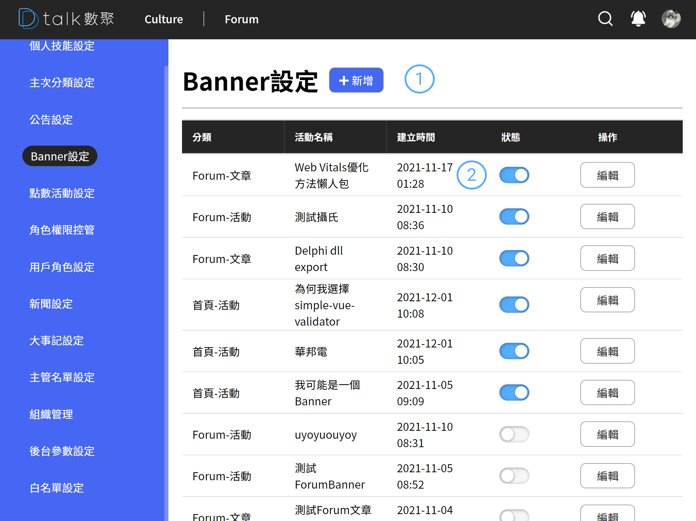

# Banner 設定

分類不提供刪除功能，僅能將分類狀態修改成不啟用。排序方式依據建立的時間先後。

## 功能

- 查看類別
- [新增類別](./addbanner.md)
- [編輯類別](./addbanner.md)

## 查看技能

####  標題+新增

後台設定作業標題以及各之作業的新增功能位置皆相同。統一由標題後新增按鈕做各支作業的新增功能

####  清單

- 資訊呈現

  呈現 Banner 分類，名稱，建立時間，啟用狀態

- 狀態

  Banner 是否顯示主要看狀態是否啟用

- 編輯

  進行編輯 參考 [新增公告](./addbanner.md)
