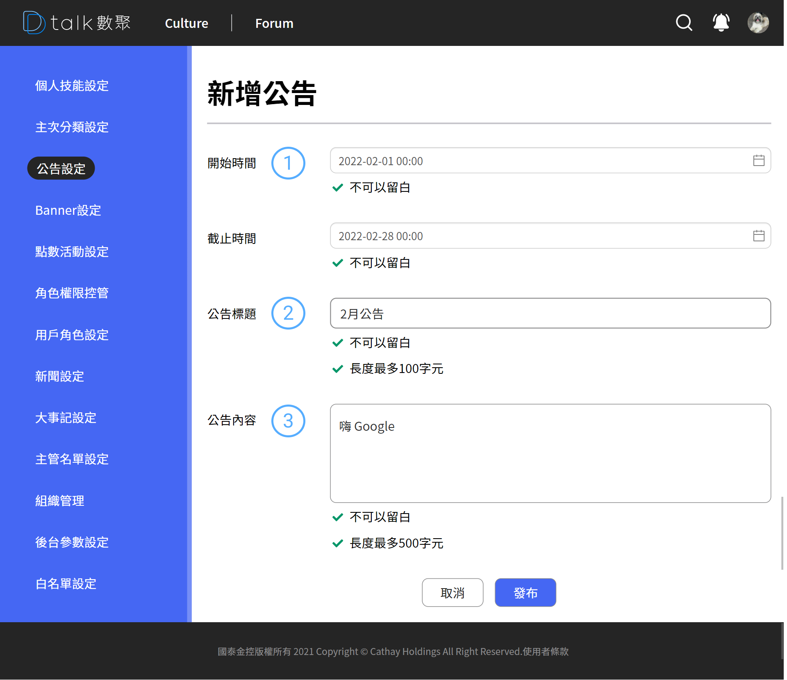

# 新增公告

####  標題+新增

後台設定作業標題以及各之作業的新增功能位置皆相同。統一由標題後新增按鈕做各支作業的新增功能

####  時間起迄

時間刻度到「時分」，選完分支後會自動關閉。如都不選可直接選擇旁邊空白處即可

####  簡易文本

簡易文本輸入，提供超連結的設定，僅輸入「**一行**」就好，多行會無法呈現完整資訊。

####  刪除

編輯模式下可視，與其他作業刪除方法相同
