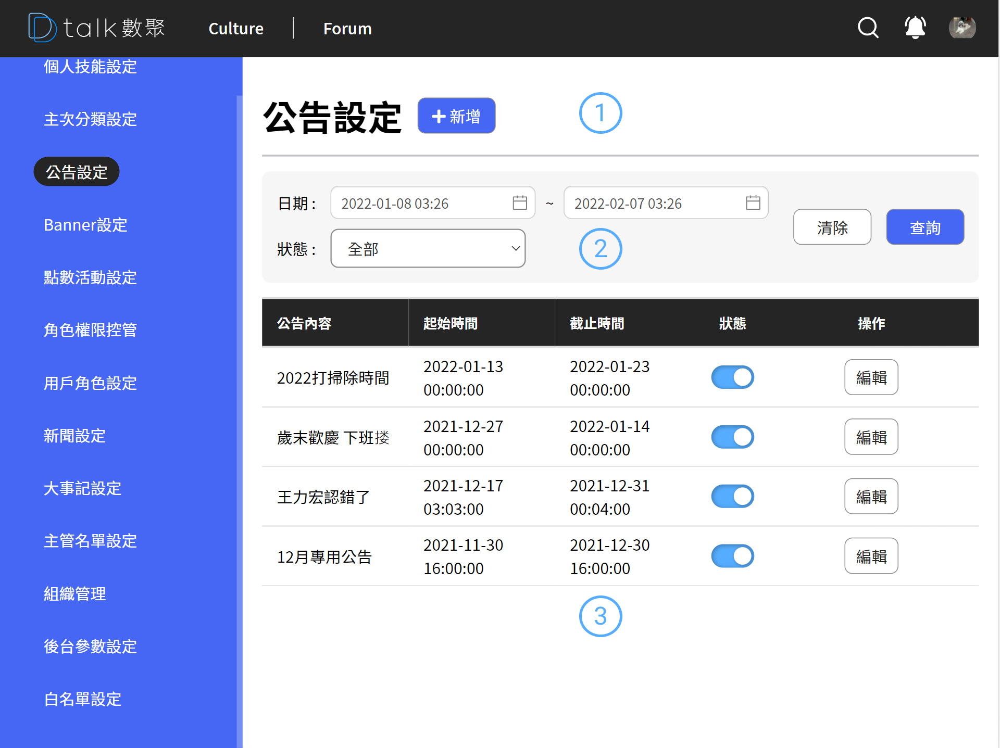

# 公告設定

公告主要呈現於 Header 下如下圖所示

#### 

## 功能

- 查看類別
- [新增公告](./addbulletin.md)
- [編輯公告](./addbulletin.md)
- [刪除公告](./addbulletin.md)

## 查看公告

####  標題+新增

後台設定作業標題以及各之作業的新增功能位置皆相同。統一由標題後新增按鈕做各支作業的新增功能

####  公告查詢

公告提供簡易的搜尋功能，可根據時間的起迄、狀態查詢，預設時間為近一年

#### 清單

- 資訊呈現

  呈現公告的內容、時間起迄，公告內容過長則消失。

- 狀態

  公告時間到期或是手動關閉狀態前台的公告則會消失。

- 編輯

  進行編輯 參考 [新增公告](./addbulletin.md)
