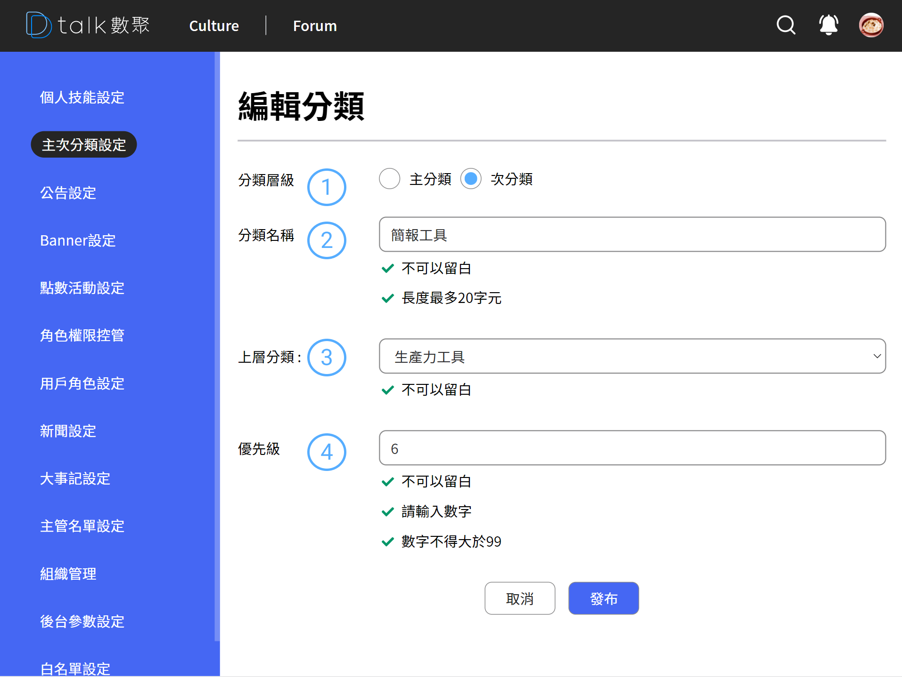

# 新增主次分類類別

新增的時候標題會是「新增分類」，編輯時會是「編輯分類」

## 新增分類

####  分類層級

目前分類層級只要兩階層，單選，必填
選擇次分類的則必須設定上層分類名稱，歸屬分類上層

####  分類名稱

必填欄位，呈現於前台的名稱

####  上層分類

僅呈現第一階層的分類名稱，當分類層級為次分類時可選

####  優先級

優先級調整分類的呈現順序，分類討論串特別多人使用，可將分類提層。方便使用者選取
