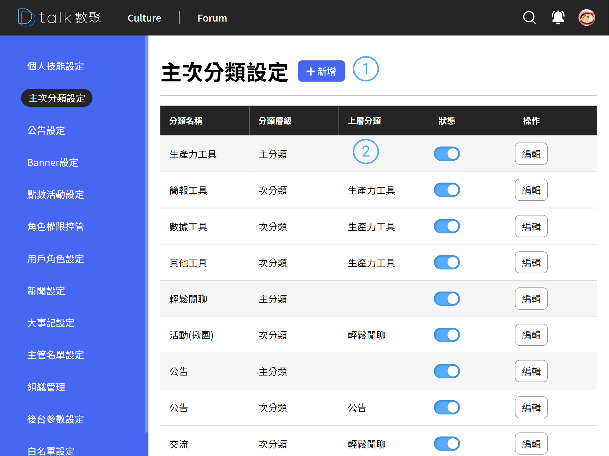
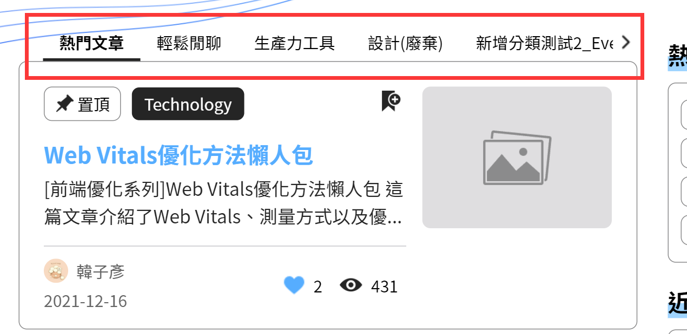

# 主次分類設定

分類不提供刪除功能，僅能將分類狀態修改成不啟用。

## 功能

- 查看類別
- [新增類別](./addcat.md)
- [編輯類別](./addcat.md)

## 查看技能

####  標題+新增

後台設定作業標題以及各之作業的新增功能位置皆相同。統一由標題後新增按鈕做各支作業的新增功能

####  清單

分類主要區分為「主分類」、「次分類」，而分類影響整個 Fourm 的呈現，因此在操作狀態以及編輯時需特別注意。

狀態設定為「不啟用」受影響範圍

- Fourm 的文章分類 Tab(如下圖所示)
- Fourm 新增文章時類別選不到

#### 
