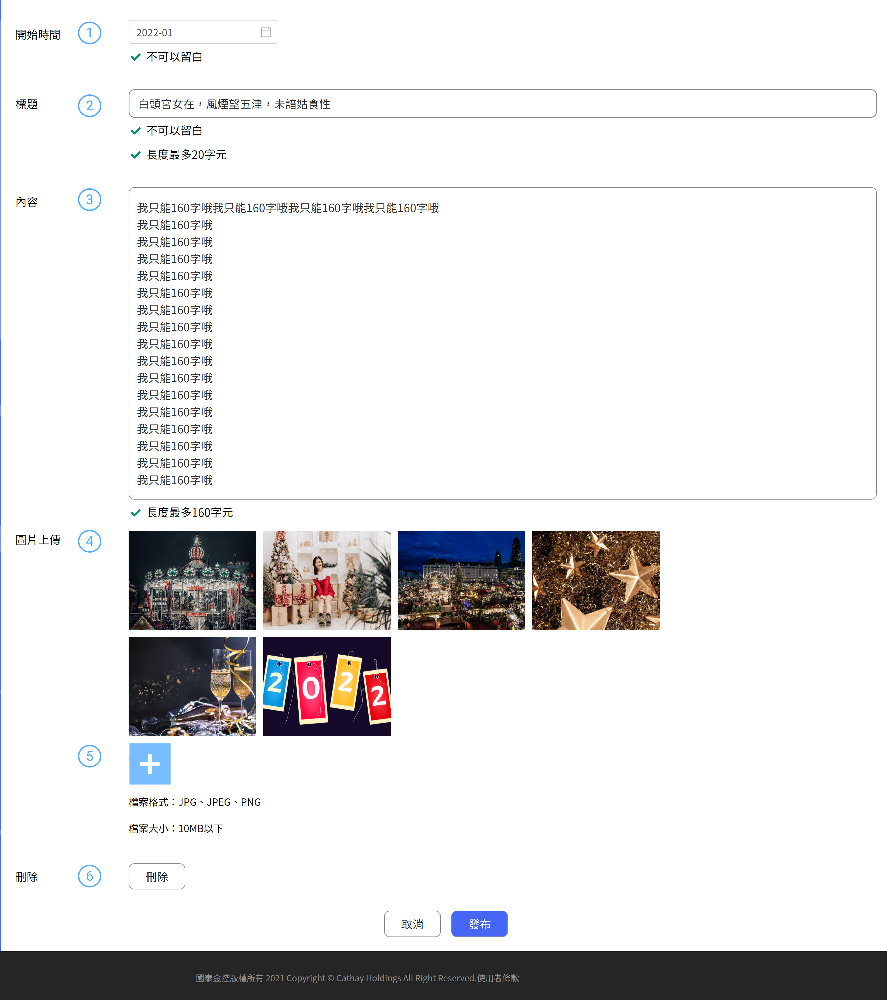

# 新增大事記

大事記可編輯圖文，每個事件可上傳多張圖片，單文字比較受到侷限。有限制長度

## 新增分類

####  開始時間

事件發生日期

####  事件標題

大事記單個事件的標題，前台呈現用

####  內文

簡單文本無提供超連結等資訊，僅一般文字輸入可支援換行

####  圖片清單

圖片呈現是按照順序的，提供圖片重新上傳。因此可以微調照片順序

- 不支持多檔上傳
- 滑鼠移動到圖片上方，點選後可重新上傳

####  圖片上傳

圖片呈現是按照順序的，提供圖片重新上傳。因此可以微調照片順序

####  刪除

提供大事記刪除，整個作業中的刪除其實不是真實的刪除資料而是將資料做 flag 的修改，如後續想救援資料可連繫資料庫維護人員做復原

