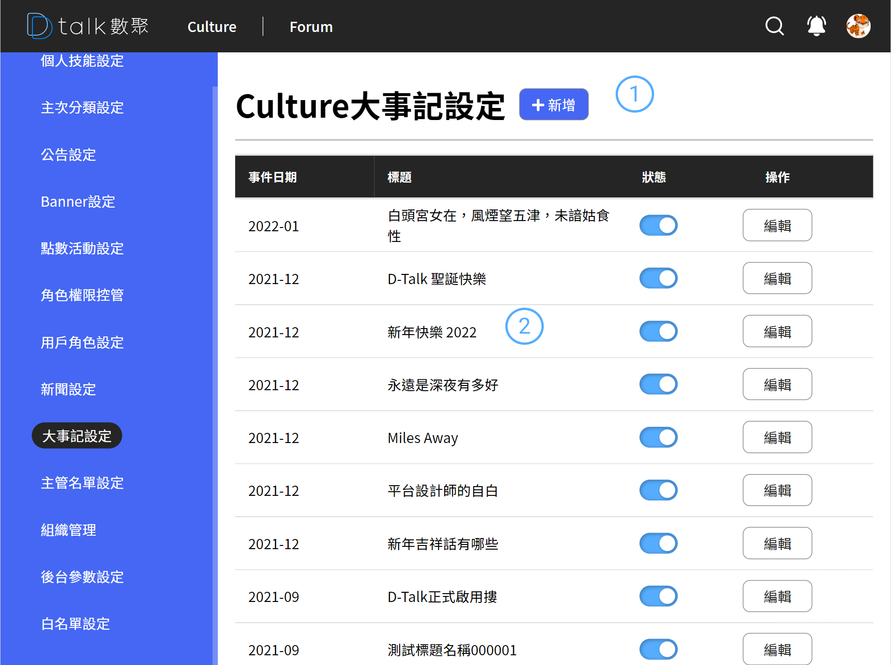

# 大事記設定

設定 Culture 的時間軸事件

## 功能

- 查看大事記
- [新增大事記](./addbigevent.md)
- [編輯大事記](./addbigevent.md)
- [刪除大事記](./addbigevent.md)

## 查看角色權限

####  標題+新增

後台設定作業標題以及各之作業的新增功能位置皆相同。統一由標題後新增按鈕做各支作業的新增功能

####  清單

- 資訊呈現

  事件日期、大事記標題

- 狀態

  停用後在前端的呈現會消失

- 編輯

  進行編輯 參考 [編輯大事記](./addbigevent.md)
