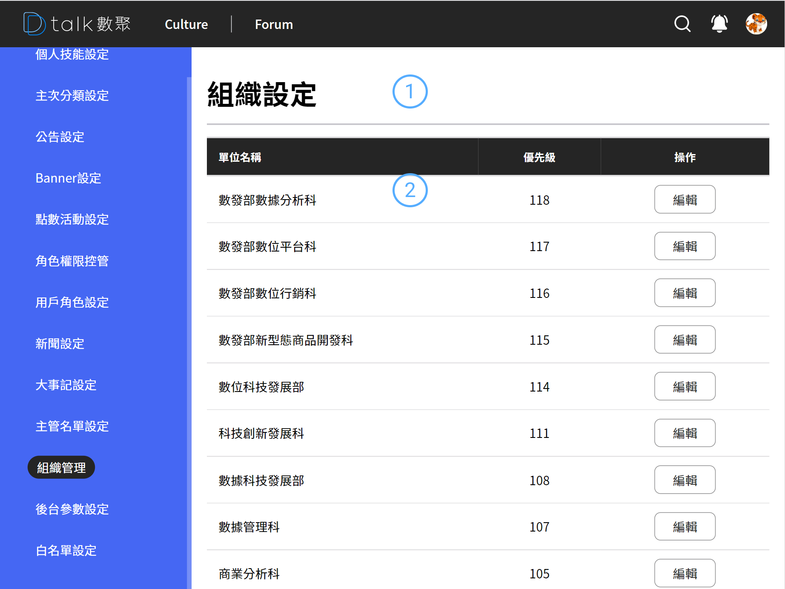

# 組織管理

組織管理無新增功能，是透過白名單結合批次轉入的基礎資料。提供
啟用與否的選擇。

應用於 culture 的組織介紹，並可個性化的設定個組織的形象圖。讓新進員工更快速的了解整個數據部的特性。

## 主要功能

- 查看組織
- [編輯組織](./adddiv.md)

####  標題

####  清單

- 資訊呈現

  單位名稱、優先級

- 狀態

  停用後則 culture 的組織介紹上則看不到該組織

- 編輯

  進行編輯 參考 [角色權限](./adddiv.md)
