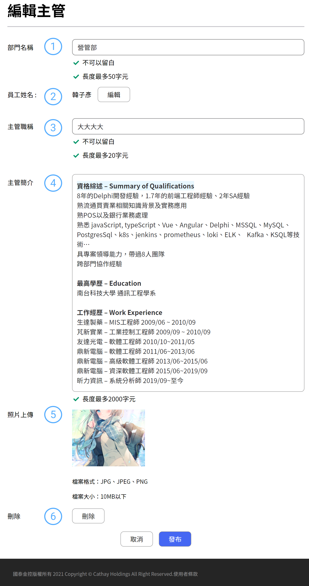

# 新增主管名單

主管名單主要是介紹高級主管們，因此系統提供透過用 E-Mail 找到對應的人選，透過管理員群組，協助主管編輯個人形象照以及簡介，讓整個數據部的同事們，更快認識主管避免搭電梯時不知道前面站的那位是大佬

## 新增分類

####  部門名稱

可自行輸入，設計原因是因為這些高階主管都身兼多職，可能兼任數據部的職務不一定是主職

####  員工姓名

主管的姓名是需透過 E-Mail 來找到這位主管。姓名會自動帶正確的姓名

####  主管職稱

職稱自由輸入，避免職稱有出入

####  主管簡介

主管簡介提供了簡易文本的輸入，提供字體加粗以及超連結的功能

####  圖片上傳

照片盡量選用直式照片※ **建議尺寸為 3:5**

####  刪除

主管刪除的話則在後台的主管設定查詢就會查不到這筆資料。
刪除提供二次提醒的功能如下圖所示

