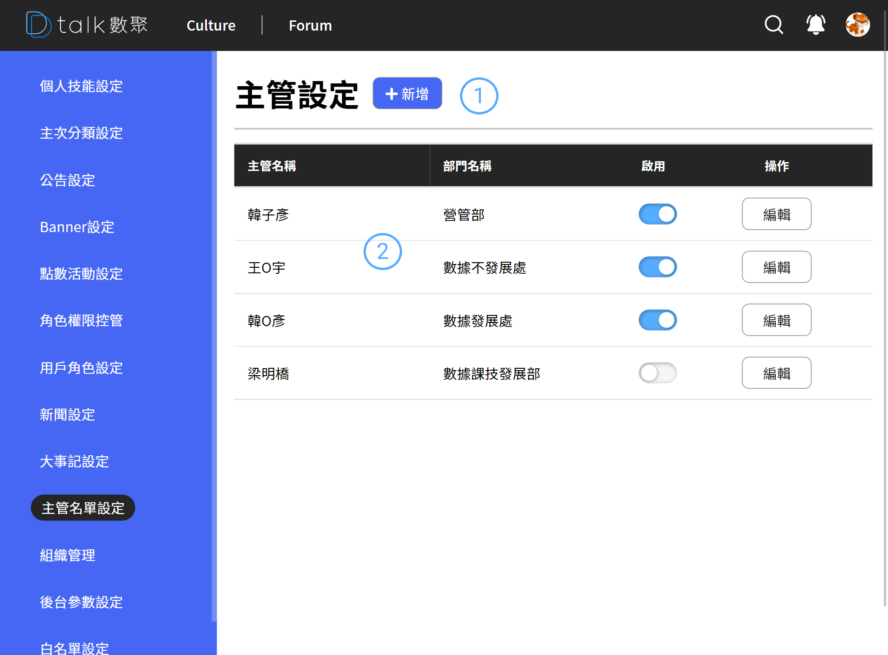

# 主管名單設定

設定 Culture 內容頁的主管介紹，並影響主管敲敲話的聯繫對象

## 功能

- 查看主管名單
- [新增主管名單](./addmanger.md)
- [編輯主管名單](./addmanger.md)
- [刪除主管名單](./addmanger.md)

## 查看角色權限

####  標題+新增

後台設定作業標題以及各之作業的新增功能位置皆相同。統一由標題後新增按鈕做各支作業的新增功能

####  清單

- 資訊呈現

  主管名稱、部門名稱

- 狀態

  停用後該主管在 Culture 前端介紹則不再顯示

- 編輯

  進行編輯 參考 [編輯主管名單](./addmanger.md)
