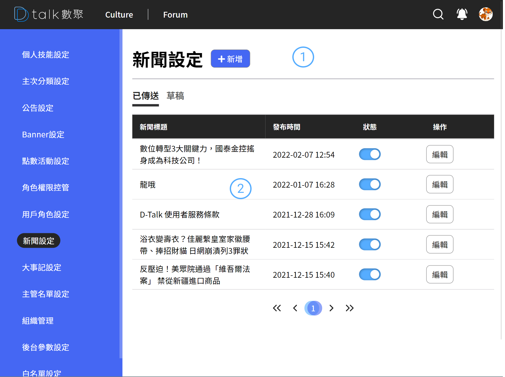

# 新聞設定

與編輯文章相同，分類歸屬於新聞，新聞的排序方式是依據發布時間而定。

## 功能

- 查看新聞
- [新增新聞](/backend/banner/addnews.md)
- [編輯新聞](./addnews.md)
- [刪除新聞](./addnews.md)

## 查看角色權限

####  標題+新增

後台設定作業標題以及各之作業的新增功能位置皆相同。統一由標題後新增按鈕做各支作業的新增功能

####  清單

- 資訊呈現

  新聞標題、發布時間

- 狀態

  停用該權限即可用此關閉，對應的用戶權限則會失效。

- 編輯

  進行編輯 參考 [角色權限](./addnews.md)
