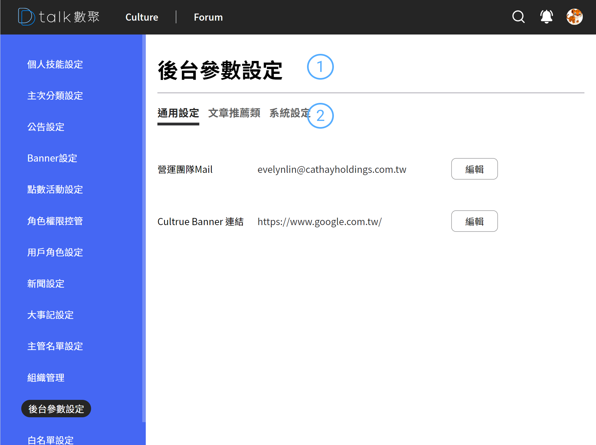
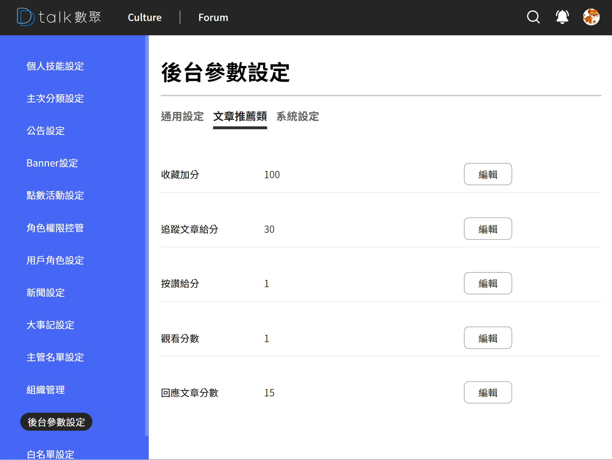
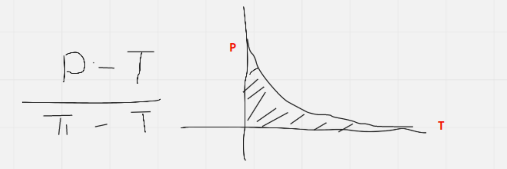

# 後台參數設定

後台參數設定目前主要有三個 tab、「通用」、「文章推薦」、「系統設定」

## 修改後台參數設定

####  標題

新聞的標題

####  頁簽

**通用類的參數**

1. 營運團隊的 Mail - 請輸入營運團隊信箱，悄悄話寄信使用
2. Cultrue 連結 - Culture 的 banner 固定連結再次設置

**文章推薦參數**

1. 收藏加分 - 個人化推薦(精選文章使用)
2. 追蹤文章給分 - 個人化推薦(精選文章使用)
3. 按讚給分 - 熱門文章統計記分使用
4. 觀看分數 - 熱門文章統計記分使用
5. 回應文章分數 - 熱門文章統計記分使用

**文章記分公式**

- 採用非線性的計算方式
- 時間越遠分數比重越低(避免新文章永遠看不到)
- 觀看文章記錄該文章 hashtag，保存 3 天，增加計分的條件
- 收藏文章記錄該文章 hashtag，保存 15 天，增加計分的條件
- 每 30 分鐘處理一次分數的計算

**系統參數**

保留中無功能
