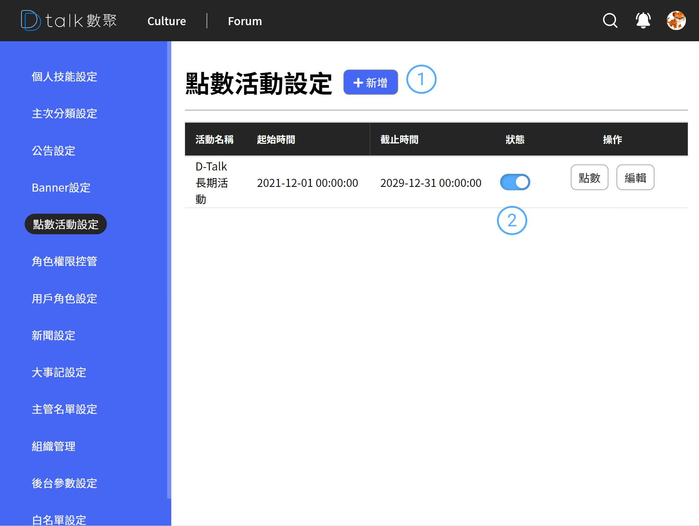

# 點數活動介紹

點數活動設定區域，設定「每日登入」、「發表文章」、「文章留言」、「按讚」的用戶點數

## 功能

- 查看活動
- [新增活動](./addpoint.md)
- [編輯活動](./addpoint.md)
- [刪除活動](./addpoint.md)
- [調整活動點數](./setpoint.md)

## 查看技能

####  標題+新增

後台設定作業標題以及各之作業的新增功能位置皆相同。統一由標題後新增按鈕做各支作業的新增功能

####  清單

- 資訊呈現

  活動名稱、時間起迄、狀態

- 狀態

  活動臨時停用可使用此功能做停用

- 編輯

  進行編輯 參考 [編輯點數](./addpoint.md)

- 點數
  可設定各類型的點數給分「每日登入」、「發表文章」、「文章留言」、「按讚」針對以上類型可做不同的分數給予
