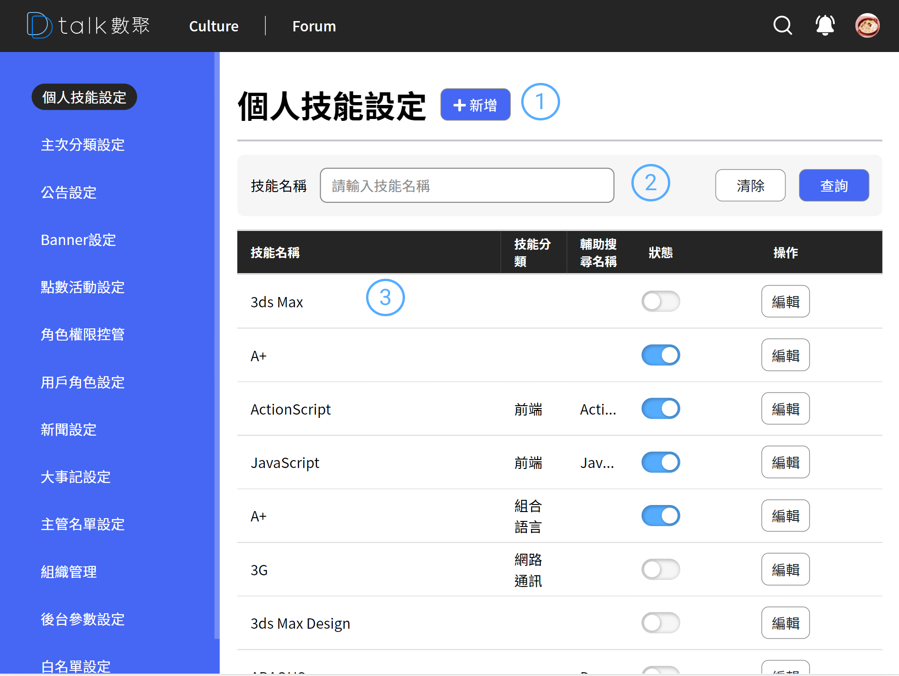

# 個人技能清單

技能不提供刪除的功能，避免發生不可逆的行為

## 功能

- 查看技能
- [新增技能](./addskills.md)
- [編輯技能](./addskills.md)

## 查看技能

####  標題+新增

後台設定作業標題以及各之作業的新增功能位置皆相同。統一由標題後新增按鈕做各支作業的新增功能

####  技能搜尋欄

技能的基礎資料超過三千多筆，提供簡易找到技能的方式，可微調技能的顯示名稱、「**輔助搜尋名稱**」、群組

- 群組目前沒有相對應的功能
- **輔助搜尋名稱** 打個比方是 Javascript 可以在輔助說明上打 es6，使用者在設定技能時就能夠方便找到相似技能

####  清單

- 資訊呈現

  呈現技能名稱、輔助搜尋名稱、群組

- 狀態

  狀態開關影響技能的呈現與是否可被搜尋，使用者曾經設定過技能，當技能關閉後，使用者技能也會消失

- 編輯

  進行編輯 參考 [參考新增技能](./addskills.md)
