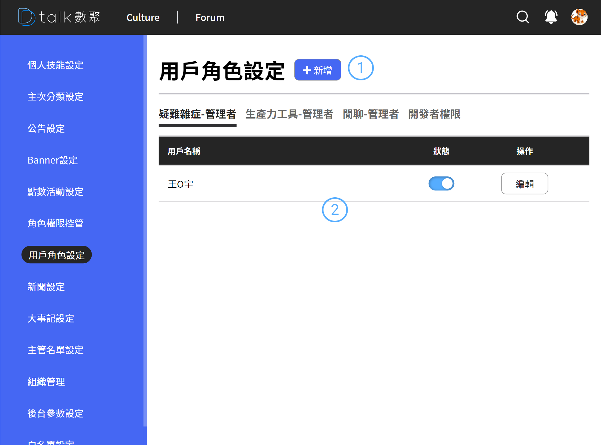

# 用戶角色設定

與權限不同，權限偏重在設定權限上，角色再去綁定設定好的權限

## 功能

- 查看用戶角色
- [新增用戶角色](./adduserrole.md)
- [編輯用戶角色](./adduserrole.md)
- [刪除用戶角色](./adduserrole.md)

## 查看用戶角色

####  標題+新增

後台設定作業標題以及各之作業的新增功能位置皆相同。統一由標題後新增按鈕做各支作業的新增功能

####  清單

- 資訊呈現

  用戶名稱

- 狀態

  如果真得要停用用戶的權限，應該來這停用，權限的停用會影響整個相同權限的人

- 編輯

  進行編輯 參考 [角色權限](./adduserrole.md)
