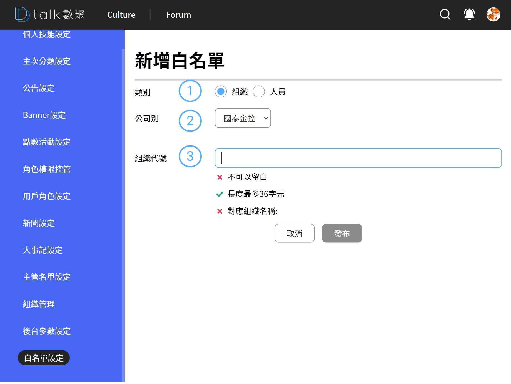

# 新增白名單

新增白名單必須依賴「單位代號」、「人員 Mail」來做處理

####  類別

選擇組織設定成功後是組織下人員皆可登入
選擇人員可特定放行某些人進入系統

####  公司別

由於一人可能跨公司別身兼多職，因此在確認白名單時必須精準到公司別

####  組織代號或 EMail

輸入預計登入的組織名稱，例如「**資料科學研發科**」，輸入成功後會自動帶上組織代號，顯示才算成功

####  刪除

與其他作業相同皆具備刪除功能
