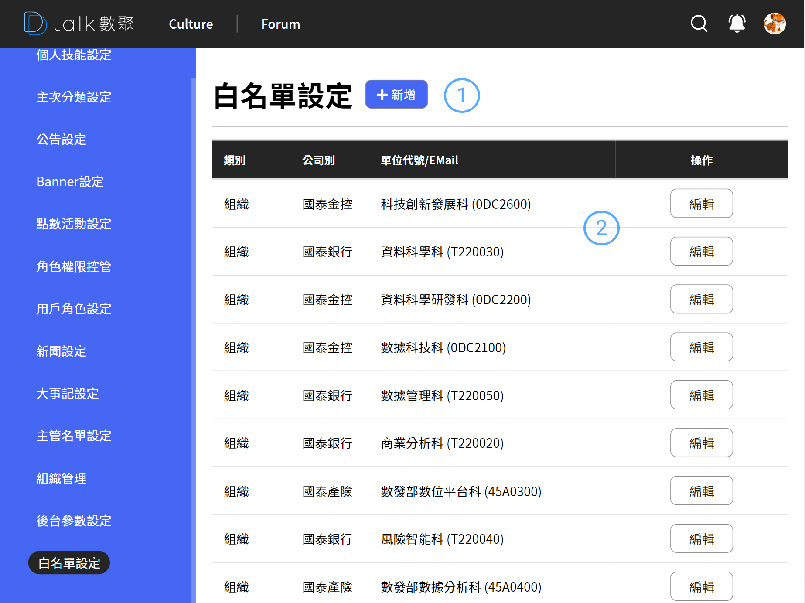

# 白名單

系統所有的人員都必須通過白名單才能進入系統，不在白名單內的組織及人員是無法正常登入此系統。

## 功能

- 查看白名單
- [新增白名單](./addwhite.md)
- [編輯白名單](./addwhite.md)
- [刪除白名單](./addwhite.md)

## 查看白名單

####  標題+新增

####  清單

- 資訊呈現

  呈現類別(組織、人員)、公司別、單位代號/EMail

- 狀態

  不提供狀態更改，不要請刪掉...

- 編輯

  進行編輯 參考 [新增白名單](./addwhite.md)
