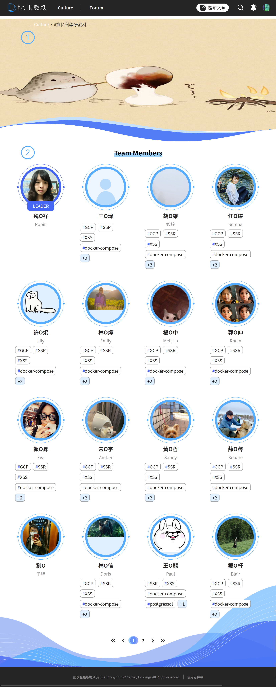

# 組織介紹

組織、成員介紹的小單元

####  單位形象圖

放置各單位準備的靜態圖，盡量符合組織說明及形象為主。

- 建議使用中性暖色的底圖，適應麵包屑的全白及全黑顯示

####  單位成員

單位主管會有「**Leader**」的外框，其餘成員**圓形圖**為主，來源是個人的資料設定的大頭貼，並顯示成員技能暱稱

- 暱稱沒設定則表示空白
- 技能顯示最多四組
- 圖片未設定則呈現「藍色小人」

點選「技能」可查詢相同技能人員(跨組織)，參考 [技能查詢人員](ji-neng-cha-xun-ren-yuan.md)
