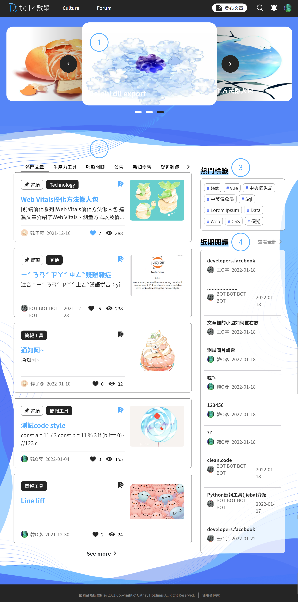

# Forum

####  **活動文章輪播**

Forum 活動輪播用於放置論壇的精華文章所使用。方便使用者第一眼看到重要的文章活動，每個 Banner 具備活動文章連結，

點選「**Banner**」後進行頁面的跳轉

#### **文章分類**

使用者可透過「**Tabs**」找到感興趣的主題。第一分類為「熱門文章」**固定**呈現，計算依據透過「**觀看數**」、「**留言數**」、「**按讚數**」而定，「熱門文章」類別不會有置頂文章。

其餘類別都有專屬的置頂文章，「**置頂文章**」會優先排在各分類的最上層，文章依「**發布時間**」最新的靠前顯示，「**眼睛**」表示該篇文章的閱讀數量。

點選「**文章標題**」進行文章的閱讀

點選「」為文章點讚

點選「」收藏喜歡的文章

點選「**See More**」可進行該類別的分頁查詢參考[文章清單頁](atclist/catsearch.md)

####  熱門 HashTag

發布文章可設定文章的標籤，熱門類別是透過標籤的使用數量而產生。僅呈現最熱門的**十組**標籤

點選「**標籤名稱**」進行相關 HashTag 的[文章搜尋](atclist/hashtag-search.md)

####  近期閱讀

個人的閱讀紀錄，排序依據閱讀時間決定，閱讀紀錄最新呈現於最上層。

點選「**文章標題**」進行文章的閱讀

點選「**查看全部**」可進行[歷史閱讀紀錄查詢](atclist/history-search.md)
