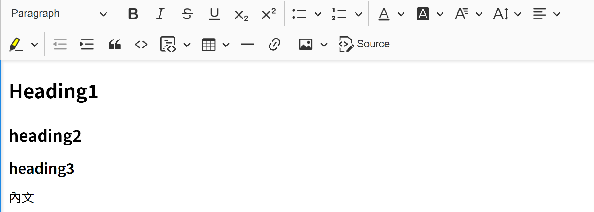
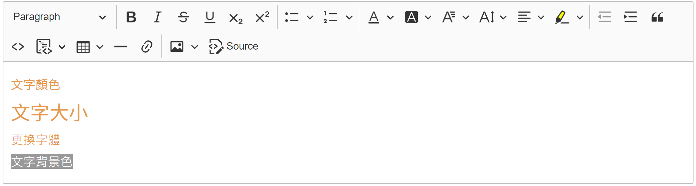
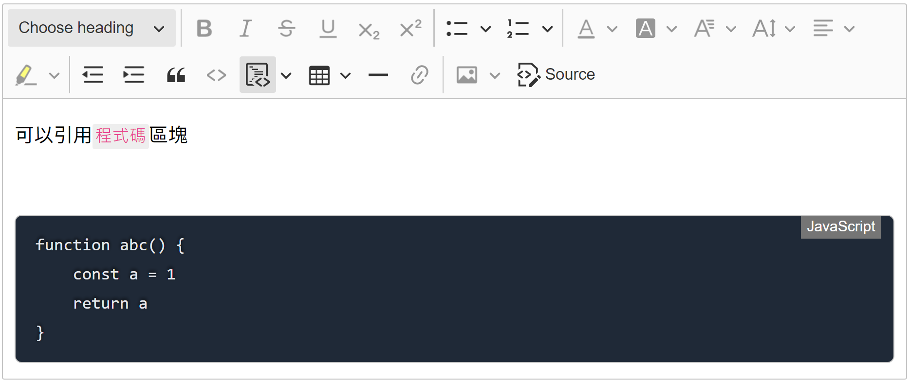
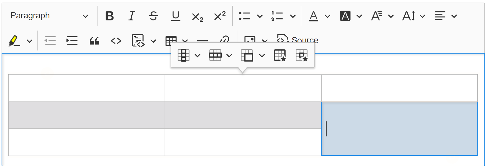
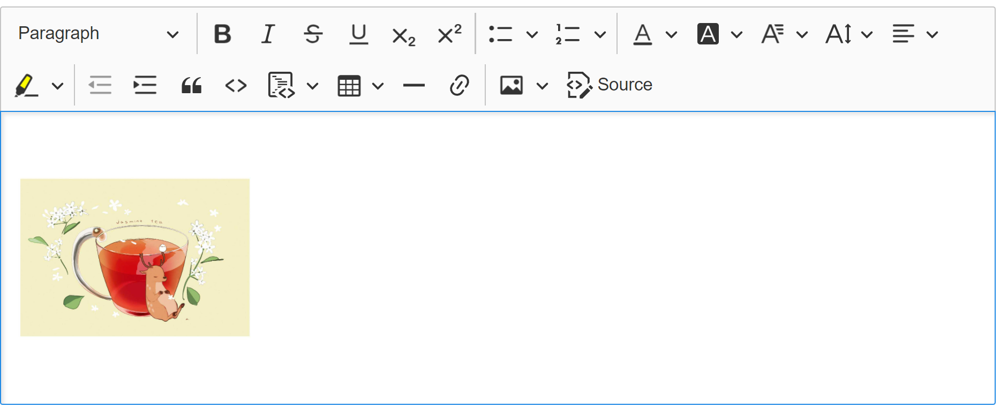
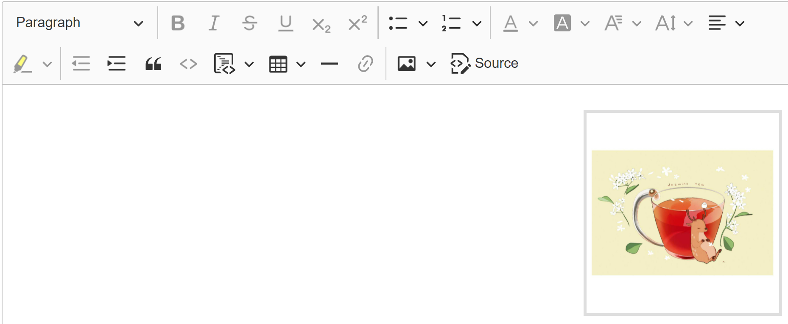

# 編輯器介紹

功能表個性功能簡介

| 樣式                                                                | 功能          | 效果                                                                                                                   |
| ------------------------------------------------------------------- | ------------- | ---------------------------------------------------------------------------------------------------------------------- |
| Choose heading                                                      | 段落          |                                                                                  |
|                          | 粗體          |                                                                                                                        |
|                          | 斜體          |                                                                                 |
|     | 刪除線        | 參考上圖                                                                                                               |
|                          | 下底線        | 參考上圖                                                                                                               |
|       | 下標          | 參考上圖                                                                                                               |
|    | 上標          | 參考上圖                                                                                                               |
|                        | 超連結        |                                                                                                                        |
|                         | 上傳圖片      | <ul><li>複製貼上</li><li>選擇檔案</li></ul>                                                                            |
|                        | 符號清單      |                                                                                 |
|         | 數字清單      |                                                                                  |
|                      | 文字顏色      |                                                                                 |
|                | 文字底色      | 參考上圖                                                                                                               |
|                     | 字體          | 參考上圖                                                                                                               |
|                       | 字體放大      | 參考上圖                                                                                                               |
|      | 文字對齊      |                                                                                  |
|              | 螢光筆        | 參考上圖                                                                                                               |
|                       | 左縮排        | 參考上圖                                                                                                               |
|                       | 右縮排        | 參考上圖                                                                                                               |
|                            | 程式碼區塊    |                                                                                 |
|                  | 程式碼區域    | 
程式碼區塊可選擇語言。預覽與實際呈現時有程式碼高亮區塊 
 |
|                    | 引用          |                                                                                 |
|                              | 表格 新增     |                                                                                  |
|          | 表格 新增欄   | 參考上圖                                                                                                               |
|  | 表格 新增列   | 參考上圖                                                                                                               |
|                 | 表格 合併欄位 | 參考上圖                                                                                                               |
|    | 分隔線        |                                                                                 |
|       | 圖片 靠左     |                                                                                 |
|    | 圖片 靠右     |                                                                                  |
|   | 圖片 置中     |                                                                                 |
