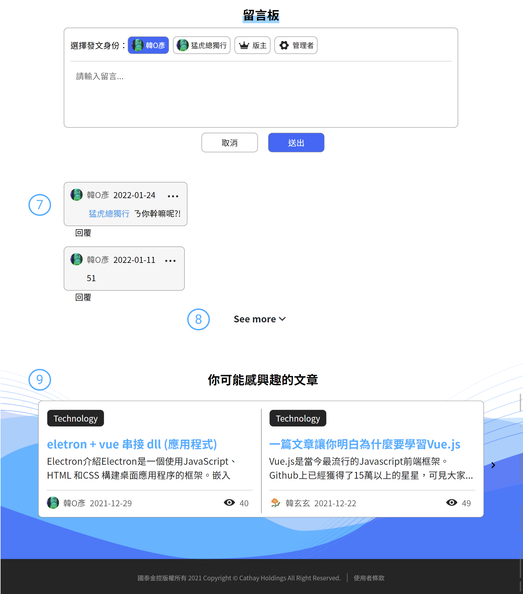
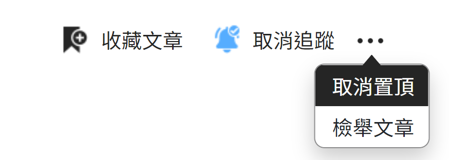
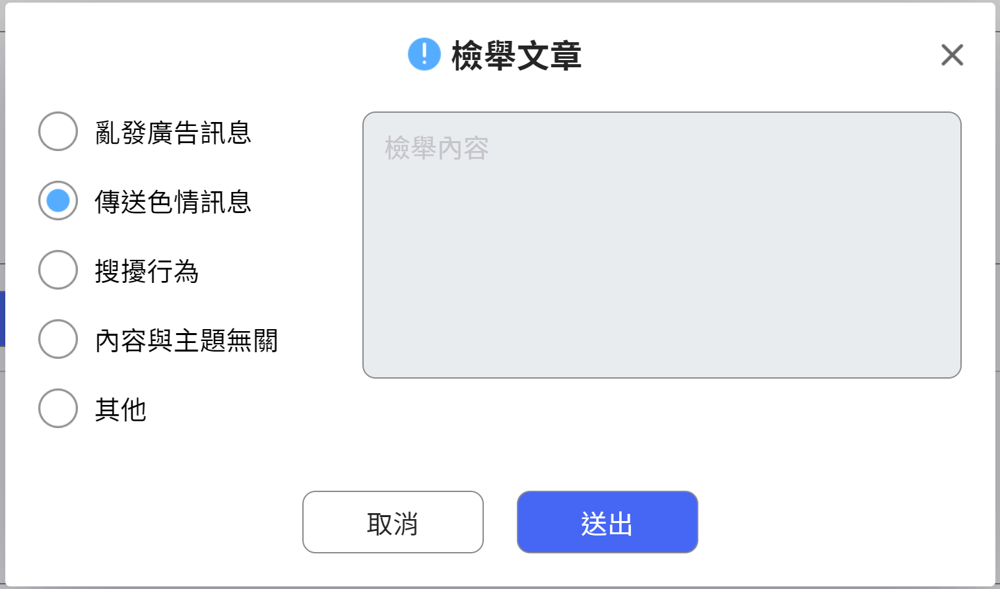

# 文章內頁說明

簡述內頁的功能用法

 

####  麵包屑

快速導航列，可透過「**主分類(新知學習)**」、「**子分類(Technology)**」來進行頁面轉換

點選「主分類」頁面跳轉至依據「主分類」查詢的文章列表

點選「子分類」頁面跳轉至依據「子分類」查詢的文章列表

####  文章資訊#1

提供作者名稱(匿名或本名)以及發文時間的顯示，「」文章按讚數，「」文章觀看數

點選「」

####  文章內文

文章是由編輯器生成，內文是使用者所編輯的內容，所見及所得。編輯器詳細介紹可[參考](ckedit.md)

####  文章資訊#2

提供文章的其他資訊，文章有的很長，按讚數量置於文章底部方便使用者閱讀後，喜歡這篇文章給予作者鼓勵。「」文章按讚數，「」文章留言數量

####  更多功能

文章提供四個功能「收藏」、「追蹤」、「檢舉」、「置頂」

「**收藏**」-使用者可以將文章作為書籤收藏起來，方便未來閱讀比較容易找到文章

「**追蹤**」-追蹤文章可以在文章有新留言時用戶的個人訊息列表會告知有新的訊息

「**檢舉**」-使用者覺得發文者的文章不妥可以透過檢舉來告知管理員群，用戶此篇文章有問題，下架權決定於管理員手中，檢舉必須填寫檢舉原因，下圖所示

**檢舉原因類型選擇「其他」輸入窗僅提供選擇其他時輸入**

「**置頂**」-僅版主與管理員具備此權限

####  留言板

留言版分成兩種狀況「**文章留言**」、「**留言回覆**」使用者對文章留言，作者收到通知，通知內容會呈現 「**你所發表的文章「文章名稱」有人回應了**」。

留言可選擇【本名】或【暱稱】，留言板上呈現的名稱使用當前暱稱，暱稱異動，文章暱稱跟隨異動。

####  留言區

用戶的留言統一集中在此，預設展開三筆

####  See Moer&#x20;

點選「See More」可檢視完整留言

####  你可能感興趣的主題

感興趣的文章主要是透過該篇文章的「主分類」與「子分類」查詢，查詢與主題最相關的 10 筆文章。點選「主題內的標題」系統進行頁面的跳轉進入該文章
