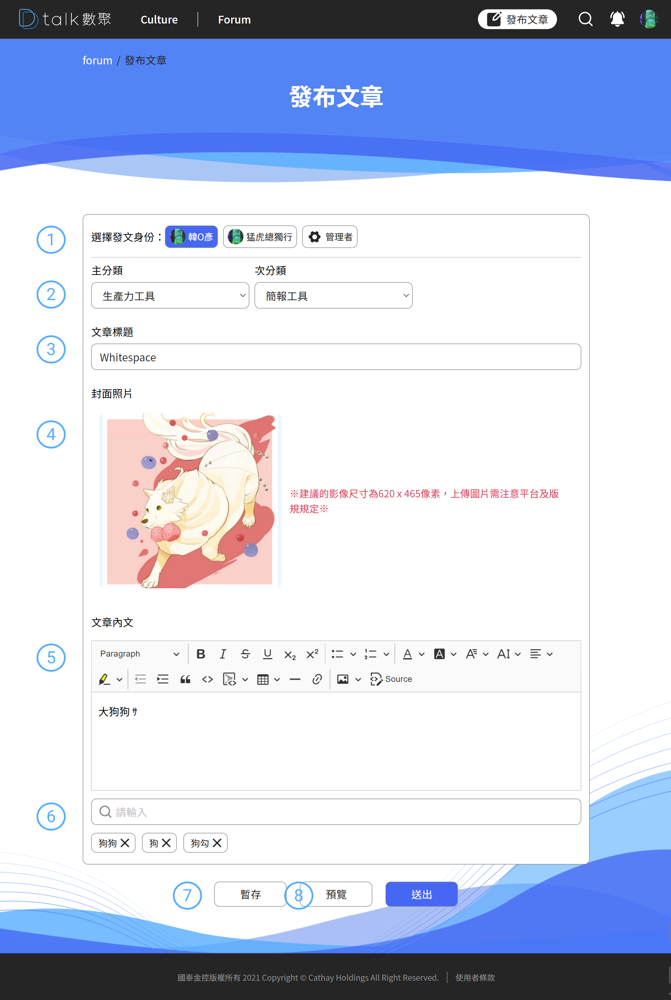

# 發布文章

介紹文章發布需注意的事項

####  選擇發文身分

身分有四種「**本名**」、「**暱稱**」「**版主**」「**管理者**」一般使用者應該只會有本名及暱稱，需在後台設定成版主後才能具備版主/管理者身分，預設身分都是本名。

####  文章資訊#1

主分類次分類選擇。

####  文章標題

輸入文章標題，最多 50 字

####  封面圖片

封面圖片的比例建議值是 620\*465 (11 : 7) 檔案大小最大可達 10MB

####  編輯器

詳細介紹可以參考 [編輯器介紹](ckedit.md)

####  文章標籤

文章打上標籤，提高文章的曝光度及用戶

####  暫存

系統每五分鐘會緩存一次，避免用戶系統直接當機或者是離開座位造成登出，也可以主動的做緩存處理，緩存的文章會暫存成草稿的狀態，如後續想繼續編輯可以到「[個人文章管理](../../member/ge-ren-wen-zhang-guan-li.md)」查詢

####  預覽&#x20;

點選「[預覽](preview.md)」可看到文章發布後的樣子，可從預覽先行得知編輯的內容有無跑版，可參考「[預覽](preview.md)」說明
