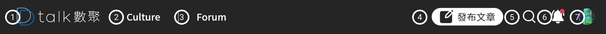

# Header

網站的 Header 提供幾個主題的連結位置。並提取網站最重要的發布文章到 Header 放置

#### ​​ Logo 

D-Talk 數聚的 Logo 圖，同時具備回首頁的功能

#### ​​ Culture 

點選後可轉頁到「[Culture](../../culture/culture/)」首頁

#### ​​ Forum 

點選後可轉頁到「[Forum](broken-reference)」首頁

####  發布文章

可參考「[發布文章](../../forum/forum/publication.md)」頁

####  全站查詢

可參考「[全站查詢](../../forum/forum/atclist/full-search.md)」說明

####  小鈴鐺通知

可參考「[小鈴鐺通知](xiao-ling-dang-tong-zhi.md)」功能說明

####  會員中心

可參考「[會員中心](membercenter.md)」功能說明
