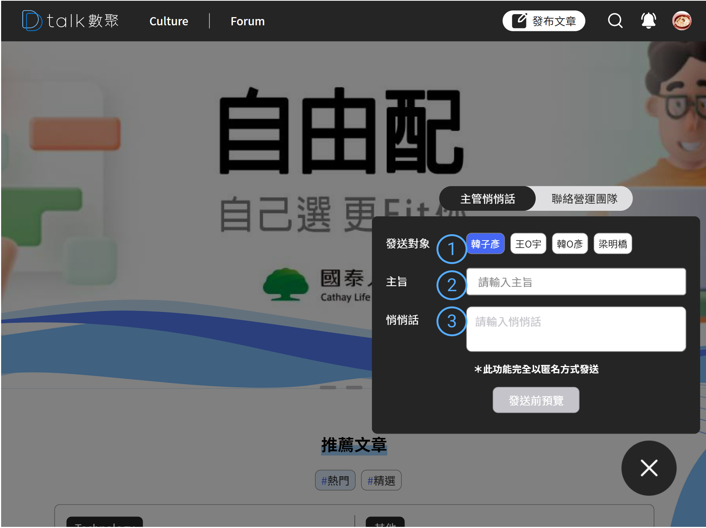
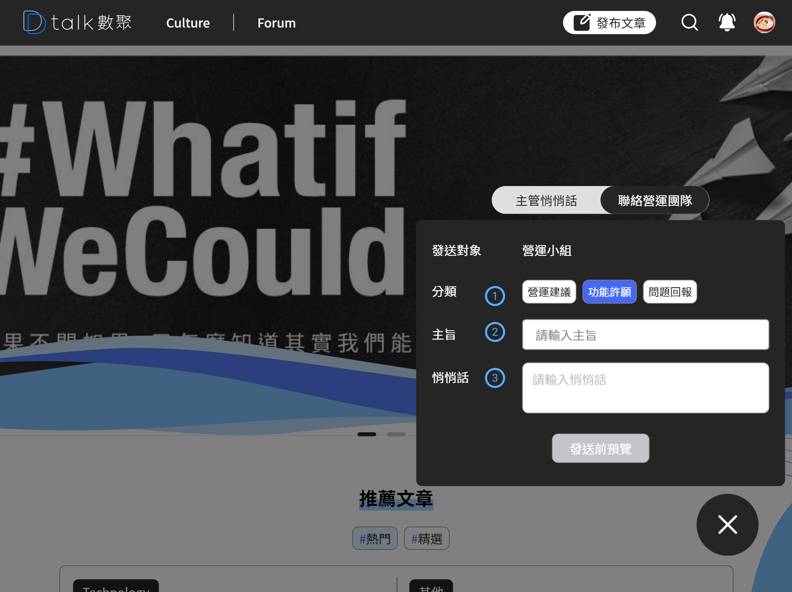
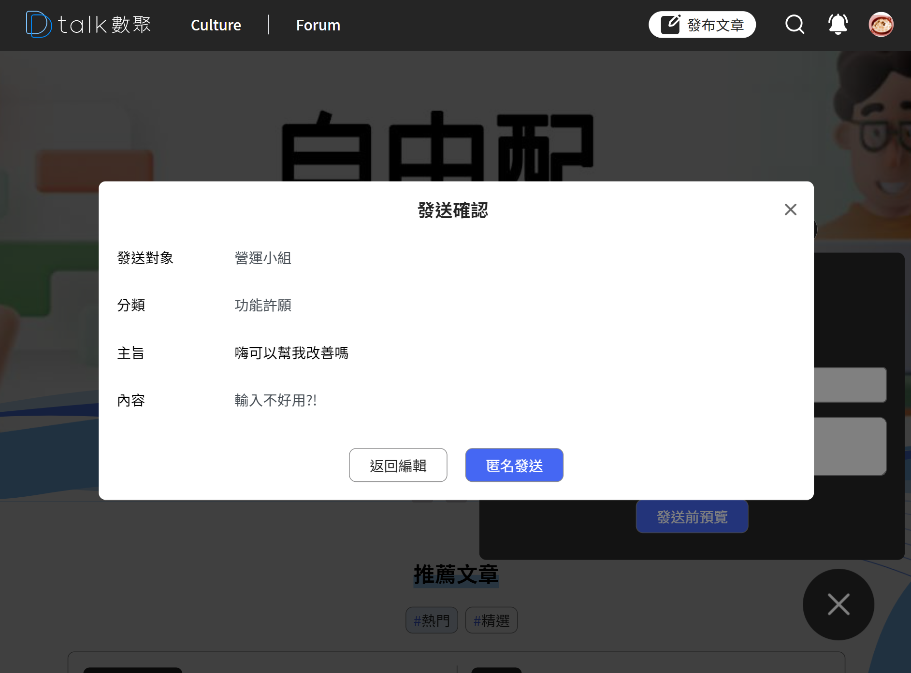
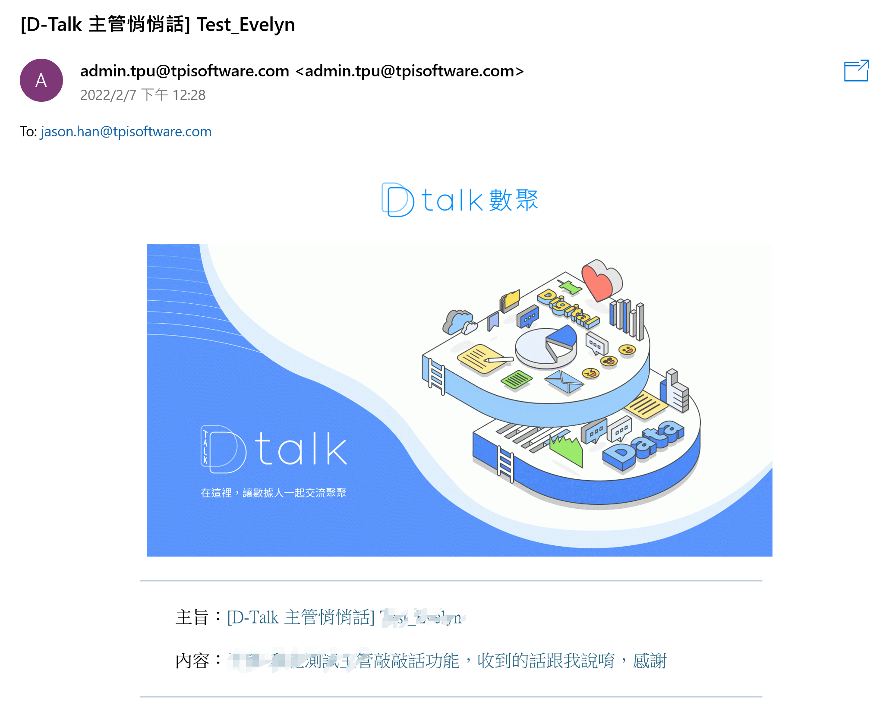

# 主管敲敲話 / 營運團隊信箱

此區可以針對一級主管寄送匿名信件，或者是有意見想給營運團隊也可以透過此管道告知營運團隊

## 主管敲敲話

####  主管名稱

提供用戶選擇要匿名寄給哪位主管，主管清單來源由後台設定。

####  主旨

主旨最多 50 個字。無副本

####  新聞換頁

內容不限制長度，純文字顯示。

## 聯絡營運團隊

---

####  選擇分類

分類主要是會在信件的標題上做分別，維運人員方便知道是要反映意見還是問題問題

####  主旨

主旨最多 50 個字。無副本

####  敲敲話

內容不限制長度，純文字顯示。

## 發送前確認

---

發送前的確認避免誤觸，避免主管收到一堆沒意義的信

## 信件內容樣式

