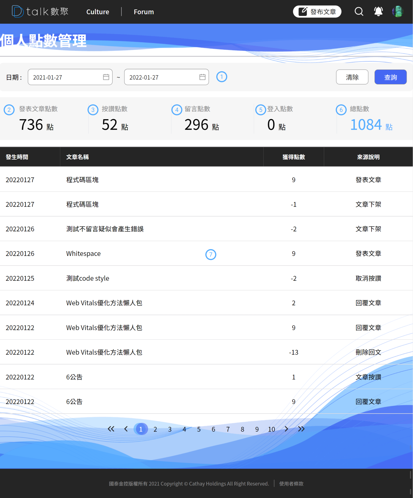

# 個人點數管理

每一筆點數產生都會有一筆紀錄，因資料過於凌亂因此將相同「類型」、「文章」、「發生日期」的資料合併處理，減少資料呈現量

#### ​ 時間起迄 

搜尋條件的時間起迄，預設帶入是一年內的文章清單

#### ​​​ 文章點數 

統計「文章上架」，「文章下架」的總分

#### ​​​ 按讚點數 

統計「文章按讚」，「取消按讚」的總分，文章按讚的受益人是「文章作者」、「按讚人員」，鼓勵觀看者多按讚

#### ​​ 留言點數 

統計「文章留言」，「留言回覆」的總分，留言者與文章作者同時得分

#### ​​ 登入點數 

每日首登總計

####  總點數

加總+​​​+​​+而得

####  列表

列表透過「類型」、「文章」、「發生日期」將資料做加總在呈現給用戶，如用戶需要調閱更詳細的明細可透過 DBA 人員協助拉取
