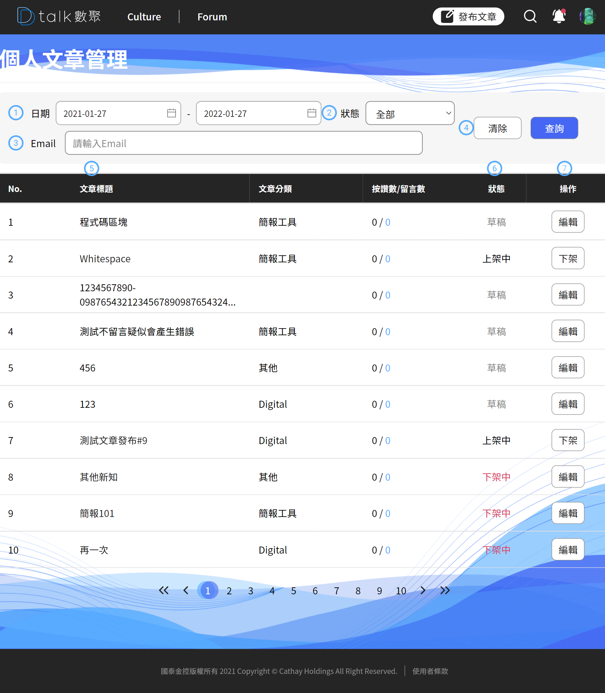

# 個人文章管理

屬於個人的文章發表皆可在此查詢，文章類型主要分成「**草稿**」、「**上架**」、「**下架**」，根據各種狀態有不同的作業模式，文章可被管理員或版主下架，下架時需填寫原因並告知使用者為何被下架

#### ​​ 時間起迄 

搜尋條件的時間起迄，預設帶入是一年內的文章清單

#### ​​ 文章狀態 

狀態分成「**草稿**」、「**上架**」、「**下架**」

草稿 -> 僅只有本人及管理員可以看到草稿內容

上架 -> 般用戶在 Forum 都能看到文章

下架 -> 需要重新編輯才能上架，Forum 看不到該篇文章。重新上架「按讚」、「留言」、「觀看數」不重製

#### ​​ E-Mail 

一般用戶是無法看到此輸入條件，此條件僅開放給管理員使用，方便查詢被檢舉的文章

#### ​​ 清除 

將時間起迄、狀態清回初始值

#### ​​ 文章標題 

可透過文章標題連結到文章內頁，文章下架狀態或者是草稿狀態是看不到留言資訊的。

####  留言板

狀態分成「**草稿**」、「**上架**」、「**下架**」分別用三種顏色作為區分。方便提高識別度

####  操作

「草稿」對應功能 -> 編輯

「上架」對應功能 -> 下架

「下架」對應功能 -> 編輯
