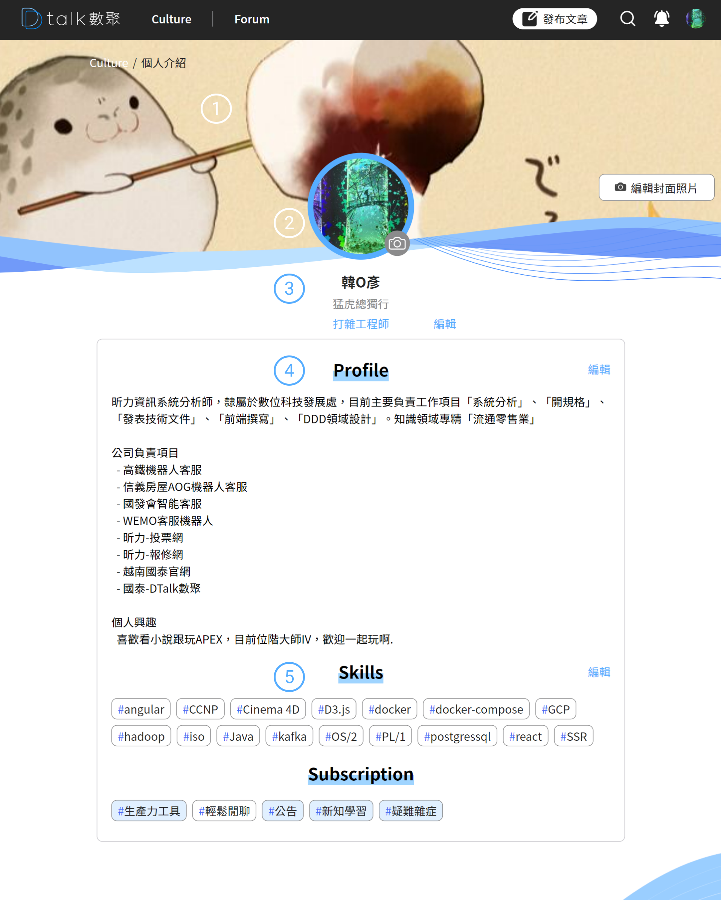
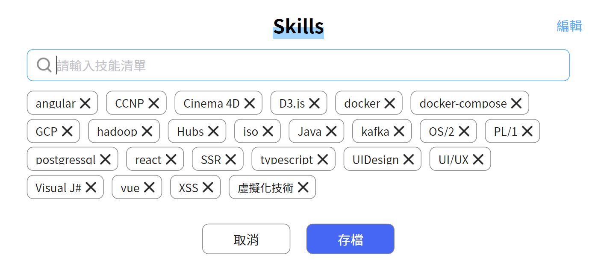
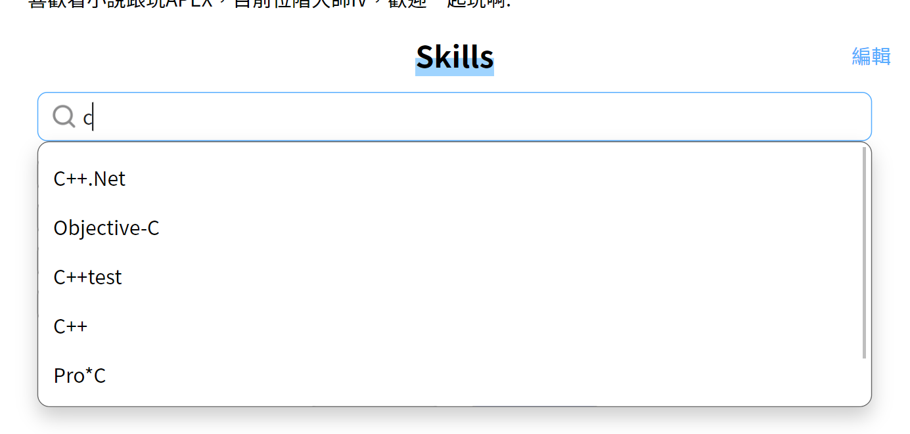

# 會員中心

#### ​​ 背景圖設置 

使用者可自行設定個人化的背景圖，背景圖有波浪切割，提供背景圖的上下拖曳微調位置

#### ​​ 大頭貼設置 

設置個人貼圖，可放大縮小拖曳調整，圖片圓形裁切

#### ​​ 個人資訊

調整「**個人姓名**」、「**暱稱**」、「**職稱**」

#### ​​ Profile 

個人資訊，無提供編輯模式，簡易的輸入換行排版，不限制字數

####  技能設置

個人技能設定，可自由的新增調整個人的技能簡介

**技能設定前**

**技能輸入後**

下拉即可選擇，技能可以輸入不存在的技能，相對使用者在找尋相同技能時，就不一定能對應到相同嗜好玩家
